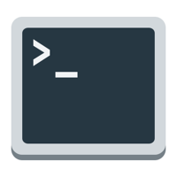
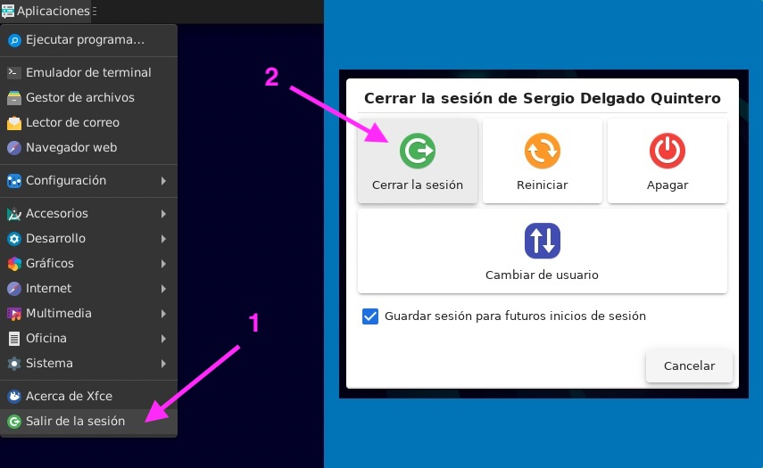

# Instalación del sistema operativo


En la búsqueda de un sistema operativo que consuma pocos recursos y que nos proporcione las herramientas que necesitamos, vamos a trabajar con [Debian](https://www.debian.org/index.es.html), un sistema operativo completamente libre que es un referente dentro del mundo Linux.

## Preparación

1. Descargar la imagen del sistema operativo [Debian 11 Netinst AMD64](https://cdimage.debian.org/debian-cd/current/amd64/iso-cd/debian-11.5.0-amd64-netinst.iso).
2. Abrir VirtualBox y crear una **nueva máquina virtual** con las siguientes características:

| Parámetro | Valor                       |
| --------- | --------------------------- |
| Nombre    | Debian PRO                  |
| Carpeta   | _(la que está por defecto)_ |
| Tipo      | Linux                       |
| Versión   | Debian (64-bit)             |
| RAM       | 4096MB                      |

3. Disco duro → Crear un disco duro virtual ahora
4. Tipo de archivo de disco duro → VDI
5. Almacenamiento en unidad de disco duro → Tamaño fijo
6. Tamaño del disco duro → 30GB
7. Disco duro → Crear un disco duro virtual ahora
8. Una vez creada la máquina, botón derecho sobre la máquina: Configuración → Red → Adaptador 1 → Conectado a: Adaptador puente

**Arrancar la máquina virtual**. En este momento nos pedirá que elijamos un disco de inicio. En el botón de selección hay que localizar la imagen que hemos descargado `.iso` (probablemente estará en la carpeta Descargas).

## Instalación

_(utilizar las teclas de cursor, ya que el ratón no funciona durante la instalación)_

1. Seleccionar **Install** desde el menú principal.
2. Seleccionar idioma **Spanish**.
3. Seleccionar país **España**.
4. Seleccionar teclado **Español**.
5. Introducir el nombre de la máquina.
6. Introducir el nombre del dominio: dejar el que viene por defecto (pulsar ENTER).
7. Introducir **la clave de superusuario** (`root`). **🚨 ¡No la olvides! 🚨**
8. Volver a confirmar la clave de superusuario.
9. Crear cuenta de usuario "ordinario":
   - Nombre completo indicando **nombre y apellidos**.
   - Nombre de usuario: todo en minúsculas y sin espacios (No más de 8-10 caracteres).
   - Contraseña. ¡No la olvides!
   - Verificar la contraseña introducida.
10. Introducir la zona horaria **Islas Canarias**.
11. Particionado del disco:
    - Indicar particionado **Guiado (utilizar todo el disco)**
    - Elegir el disco a particionar: Sólo debería haber uno.
    - Esquema de particionado: **Todos los ficheros en una partición**.
    - Particionado de discos: **Finalizar el particionado y escribir los cambios en el disco**.
    - ¿Desea escribir los cambios en los discos? **Sí** (utilizar tabulador para cambiar de opción)
12. Gestor de paquetes:
    - ¿Desea analizar otros medios de instalación adicionales? **No**.
    - País de la réplica de Debian: **España**.
    - Réplica de Debian: **deb.debian.org**
    - Proxy HTTP: **Dejar en blanco** (pulsar ENTER)
    - ¿Desea participar en la encuesta sobre el uso de paquetes? **No**.
13. Elegir los programas a instalar. **🚨 Marcar ÚNICAMENTE lo siguiente** (utilizando los cursores y la barra espaciadora) **Desmarcar lo que no corresponda 🚨**:
    - [x] Xfce.
    - [x] SSH Server.
    - [x] Utilidades estándar del sistema.  
           _(utilizar el tabulador y luego ENTER para continuar)_
14. GRUB:
    - ¿Desea instalar el cargador de arranque GRUB en su unidad principal? → **Sí**
    - Dispositivo donde instalar el cargador de arranque: **/dev/sda**
15. Instalación completada: **Continuar**

## Sudoers

Por defecto, el único usuario que tiene "superpoderes" en Linux es `root` (superusuario). Pero nos puede venir bien que nuestro usuario "ordinario" también sea un superhéroe. Para ello debemos hacerlo _sudoer_.

Después de arrancar la máquina virtual que acabamos de crear, iniciamos sesión con nuestro usuario "ordinario", abrimos una **terminal** y ejecutamos lo siguiente:



```console
su -c "/sbin/addgroup <usuario> sudo"
```

> 💡 &nbsp;No incluyas los angulitos `<` `>` en la instrucción, sustituye por el nombre de tu usuario.

A continuación debes **salir de la sesión y volver a entrar** para que los cambios surtan efecto.


