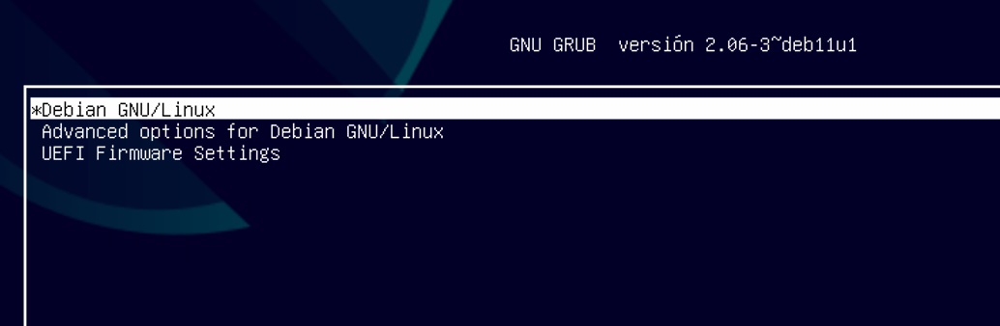
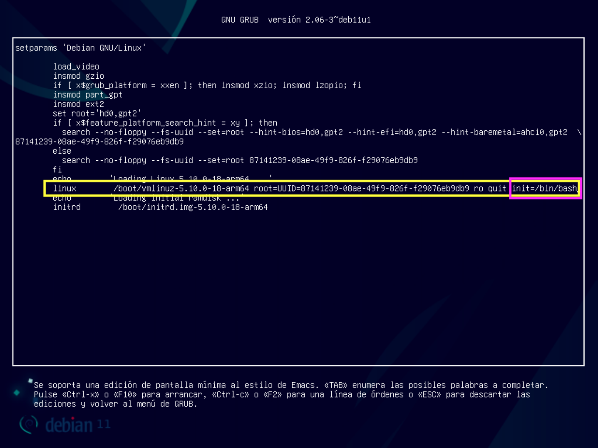
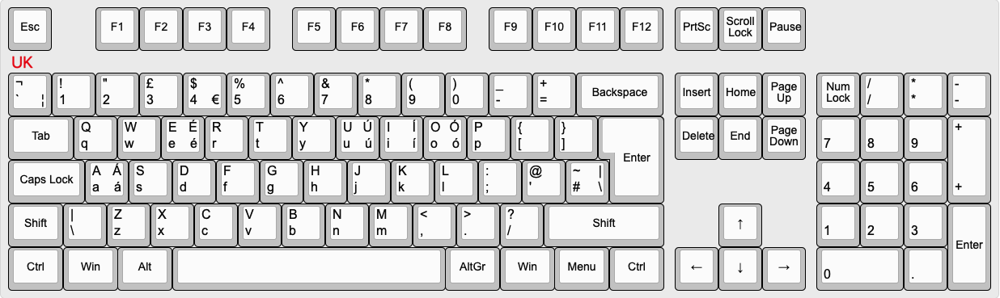
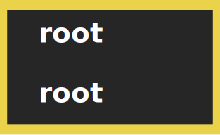
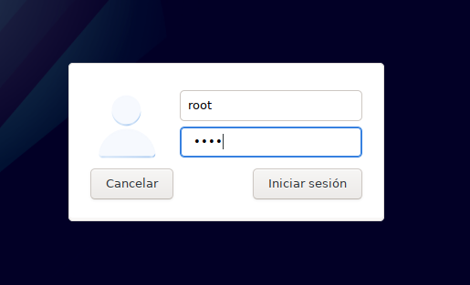

# Resetear password de root

Si por lo que fuera, en la instalación del sistema, o en algún momento posterior, olvidaras la contraseña de `root`, debemos realizar los siguientes pasos para poder restaurarla.

**Arrancamos la máquina** y esperamos a que aparezca el cargador de arranque [GRUB](https://es.wikipedia.org/wiki/GNU_GRUB):



Situados encima de la opción \*Debian GNU/Linux **pulsamos la tecla <kbd>e</kbd>** lo que hará que nos aparezca el menú con las opciones de arranque. Debemos modificar la línea que termina por `quit` añadiendo `init=/bin/bash` tal cual se indica aquí:



Ten en cuenta que **la disposición del teclado está en UK** así que debes fijarte en la siguiente distribución:



Una vez que hemos modificado la línea correctamente, **pulsamos <kbd>CTRL-X</kbd>**. La máquina se reiniciará y llegaremos a una sesión de terminal en modo texto similar a la siguiente:


Lo primero será montar el sistema de ficheros con el siguiente comando:

```console
mount -o remount rw /
```

A continuación lanzamos el comando para cambiar la contraseña de `root`:

```console
passwd
```

Y escribimos lo siguiente:



> 💡 Aunque no lo veas, sí estás escribiendo la contraseña. Tienes que repetirla.

Ahora reiniciamos la máquina:

```console
reboot -f
```

Esperamos a la ventana de inicio de sesión habitual, y entramos con las credenciales:

- **USUARIO**: `root`
- **CONTRASEÑA**: `root`



Una vez dentro, **abrimos una terminal** y **modificamos la contraseña** de `root`:

```console
passwd
```

🚨 **Aparecerá un mensaje para escribir la nueva contraseña. Y luego otro mensaje para confirmarla. ¡No olvides esta contraseña!** 🚨
