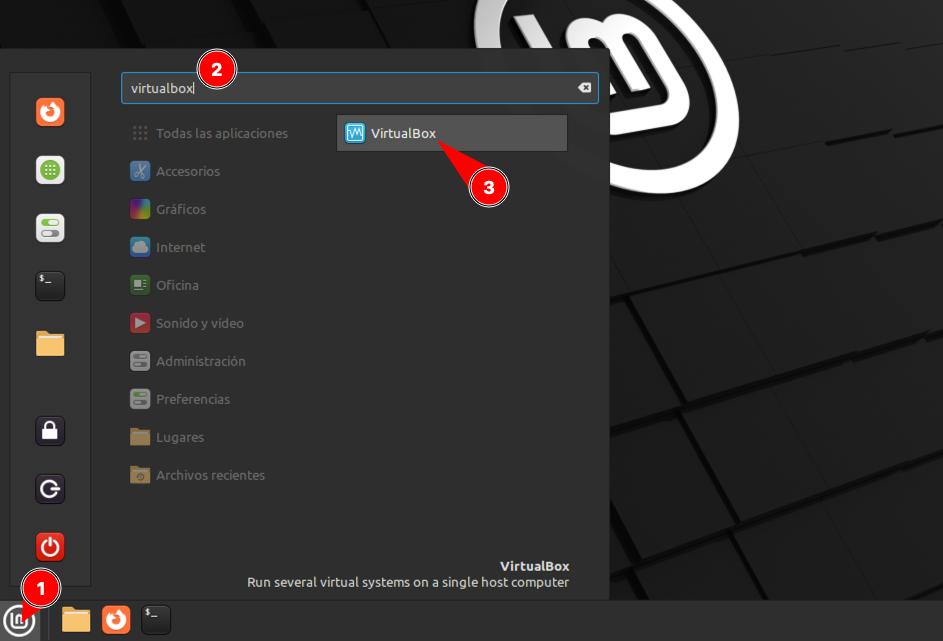
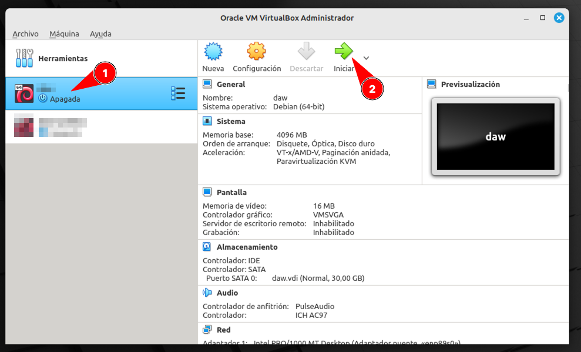
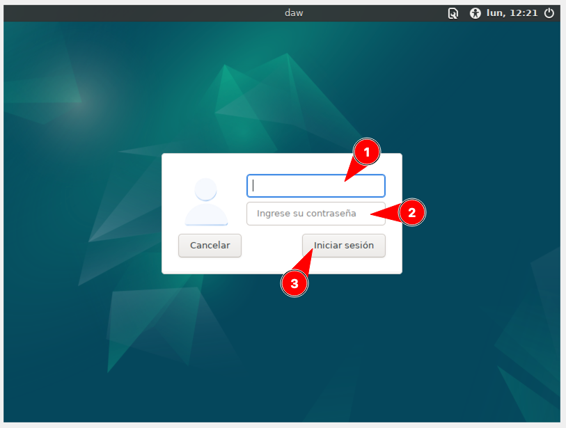

# VirtualBox

Abrimos una terminal **desde la máquina real**:


Y ejecutamos lo siguiente:

```console
curl http://amy/daw/1daw/pro/bootstrap.sh | bash -s pro
```

> ⚠️ Este proceso puede durar varios minutos. ¡Paciencia!

Ahora abrimos VirtualBox:



Debería aparecer una nueva máquina virtual llamada **pro**. Arrancamos esta máquina:



En pocos segundos nos aparecerá la **ventana de login**:



Accedemos al sistema con las siguientes credenciales:

- Usuario: `alu`
- Contraseña: `tranquilidad`

A continuación abrimos una terminal **desde la máquina virtual**:


Y ejecutamos lo siguiente:

```console
curl http://amy/daw/1daw/pro/setup.sh | bash -s pro
```

> ⚠️ Cuando nos lo solicite tendremos que poner la contraseña (ojo porque no se ve cuando la escribimos).
