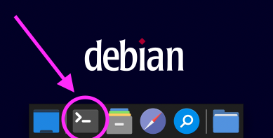
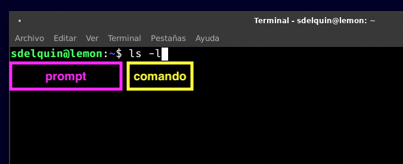

# La terminal


Una **terminal** es una **interfaz de tipo texto** que nos permite **enviar comandos** al sistema operativo. Suele ser más habitual en sistemas tipo Linux pero también las encontramos en Windows/MacOS.

**Su manejo es fundamental** para cualquier persona que se vaya a dedicar al mundo de la programación ya que nos permite ir muy rápido a la hora de realizar tareas habituales.

## Apertura de la terminal

Basta con pulsar el icono correspondiente:



## Anatomía de la terminal

Se distinguen los siguientes elementos:



1. El **prompt** es un elemento compuesto de `<usuario>@<máquina>:<ruta-actual>`
2. El **comando** es un elemento compuesto de `<comando> <argumentos>`

> 💡 Es muy habitual en la documentación encontrar el prompt únicamente con el símbolo `$`

## Comandos básicos

### `mkdir`

Permite crear una carpeta (directorio):

```console
$ mkdir pro
```

> 💡 `mkdir -p` crea todos las carpetas necesarias "entre medio".

### `cd`

Permite cambiar de carpeta:

```console
$ cd pro
```

> 💡 `cd` "a secas" te lleva a tu 🏠 `/home/sdelquin`

### `ls`

Permite listar el contenido de la carpeta:

```console
$ ls
Descargas  Documentos  Escritorio  Imágenes  Música  Plantillas  pro  Público  Vídeos
```

> 💡 `ls -l` muestra una lista en columna con más detalles por archivo.

### `rm`

Permite borrar un fichero:

```console
$ rm test.txt
```

> 💡 `rm -r` permite borrar una carpeta. ⚠️ ¡Cuidado con esto porque puede ser peligroso!

### `cat`

Permite visualizar el contenido de un fichero:

```console
$ cat test.txt
```

> 💡 `bat` es un "cat mejorado" aunque puede que sólo lo tengas disponible en algunos sistemas.
