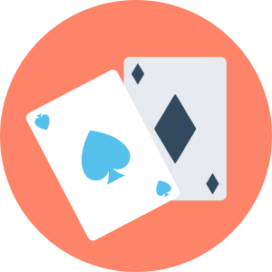

# UT4-TE2: Objetos y clases

### TAREA EVALUABLE



## Objetivo

Escriba un programa en Python que permita simular el comportamiento de una partida de cartas de poker modalidad **TEXAS HOLDEM** utilizando técnicas de programación orientada a objetos.

## Propuesta de módulos

Propuesta de módulos y clases por módulo:

```
├── test_poker.py
├── game.py
│   └── Game
├── cards.py
│   ├── Card
│   ├── Deck
│   └── Hand
└── roles.py
    ├── Dealer
    └── Player
```

### Game

- Datos:
  - Deck
  - Players
  - Dealer
- Responsabilidades:
  - Crear un mazo
  - Crear los jugadores
  - Crear el dealer
  - Comenzar la partida (repartir cartas, buscar mejor combinación)
  - Finalizar la partida (mostrar el ganador y su mano)

### Dealer

- Datos:
  - Mazo
  - Jugadores
- Responsabilidades:
  - Destapar cartas comunes
  - Dar cartas a los jugadores
  - Ver la mejor mano de cada jugador
  - Dictaminar la mejor mano

### Player

- Datos:
  - Nombre
  - 2 cartas propias
  - 5 cartas comunes
- Responsabilidades:
  - Encontrar su mejor combinación de cartas

### Card

- Datos:
  - Número de la carta
  - Palo de la carta
- Responsabilidades:
  - Saber si una carta es menor que otra
  - Representar la carta

### Deck

- Datos:
  - 52 cartas
- Responsabilidades:
  - Dar cartas aleatorias

### Hand

- Datos:
  - 5 cartas
- Responsabilidades:
  - Descubrir la categoría de la mano
  - Asignar una puntuación a la categoría
  - Saber si una mano es mejor que otra

## Comprobación

Debe existir una función `game.get_winner()` con la siguiente definición:

```python
def get_winner(
    players: list[Player],
    common_cards: list[Card],
    private_cards: list[list[Card]],
) -> tuple[Player | None, Hand]:
```

Esta función debe retornar el jugador ganador y la mano ganadora. En caso de empate, el jugador será valor `None` pero la mano ganadora sí tendrá un valor.

→ Puedes descargar aquí el [fichero de tests](solution/test_poker.py) para pytest.

### Requerimientos de implementación

- Se debe poder construir un objecto `Player` pasando el nombre del jugador. **Ejemplos**: `Player('Player 1'), Player('Player 2')`
- Se debe poder construir un objecto `Card` desde una cadena de texto. **Ejemplos**: `Card('Q♠'), Card('7♣'), Card('A♠')`
- El objeto `Hand` debe contener un atributo `cat` que represente la categoría de la mano, con una de las siguientes constantes:
- El objeto `Hand` debe contener un atributo `cat` que identifique la categoría de la mano así como un atributo `cat_rank` que almacene el "ranking" de su categoría. En la mayoría de casos es la carta más alta, pero no siempre. **Ejemplos**:

| `hand.cat`             | `hand.cat_rank` | Explicación                                   |
| ---------------------- | --------------- | --------------------------------------------- |
| `Hand.HIGH_CARD`       | `'J'`           | Carta más álta                                |
| `Hand.ONE_PAIR`        | `'5'`           | Carta más álta                                |
| `Hand.TWO_PAIR`        | `('10', '7')`   | Tupla con cartas más altas (de mayor a menor) |
| `Hand.THREE_OF_A_KIND` | `'K'`           | Carta más álta                                |
| `Hand.STRAIGTH`        | `'9'`           | Carta más álta                                |
| `Hand.FLUSH`           | `'Q'`           | Carta más álta                                |
| `Hand.FULL_HOUSE`      | `('3', 'J')`    | Tupla con carta del trío y carta de la pareja |
| `Hand.FOUR_OF_A_KIND`  | `'Q'`           | Carta más álta                                |
| `Hand.STRAIGHT_FLUSH`  | `'7'`           | Carta más álta                                |

### Módulo helpers

El fichero [helpers.py](./helpers.py) contiene funciones de apoyo al desarrollo del proyecto.

#### `randint(a, b)`

Genera un valor entero aleatorio entre `a` y `b` incluidos:

```python
>>> import helpers

>>> helpers.randint(1, 52)
8

>>> helpers.randint(1, 4)
2
```

Si sólo se pasa un argumento, devolverá un valor aleatorio entre 0 y el argumento pasado:

```python
>>> helpers.randint(10)
1

>>> helpers.randint(10)
6
```

#### `shuffle(items)`

Baraja los elementos que hay en `items`. No devuelve nada. La modificación queda en `items`:

```python
>>> cards = ['A', 'J', 'K', 'Q']

>>> helpers.shuffle(cards)

>>> cards
['Q', 'A', 'K', 'J']
```

#### `combinations(values, n)`

Genera todas las combinaciones posibles de `values` de tamaño `n`:

```python
>>> list(helpers.combinations((1, 2, 3, 4, 5), n=3))
[(1, 2, 3),
 (1, 2, 4),
 (1, 2, 5),
 (1, 3, 4),
 (1, 3, 5),
 (1, 4, 5),
 (2, 3, 4),
 (2, 3, 5),
 (2, 4, 5),
 (3, 4, 5)]
```

> 💡 El parámetro `n` debe pasarse por nombre.

## Referencias

- [Anatomía de una carta de poker](https://bit.ly/45KP9jp)
- [Lista de posibles manos ganadoras](https://en.wikipedia.org/wiki/List_of_poker_hands)
- [Calculadora online de mano ganadora](https://www.pokerlistings.com/which-hand-wins-calculator)
